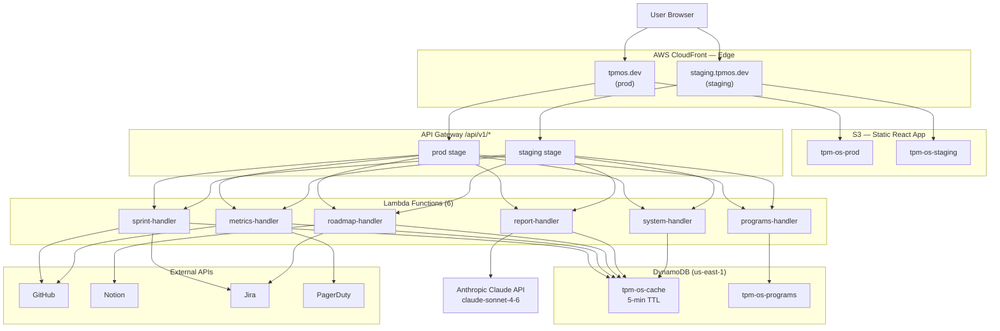
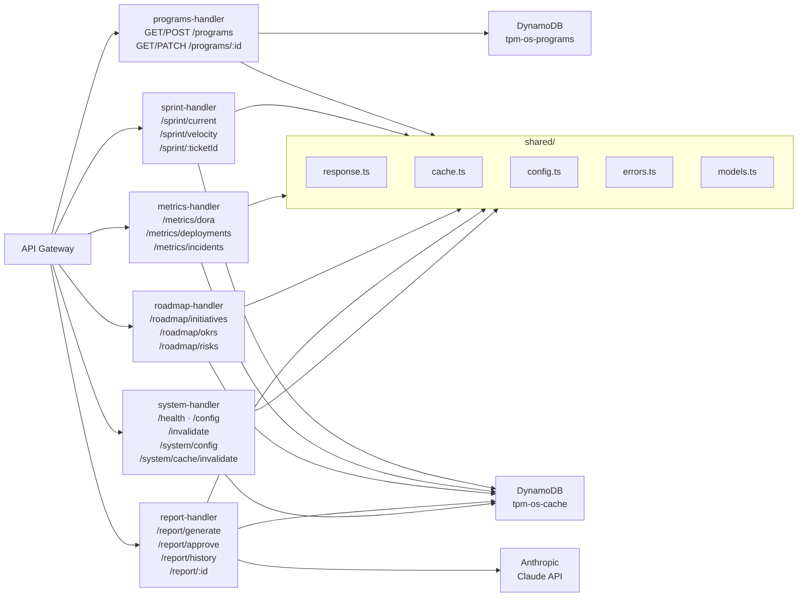
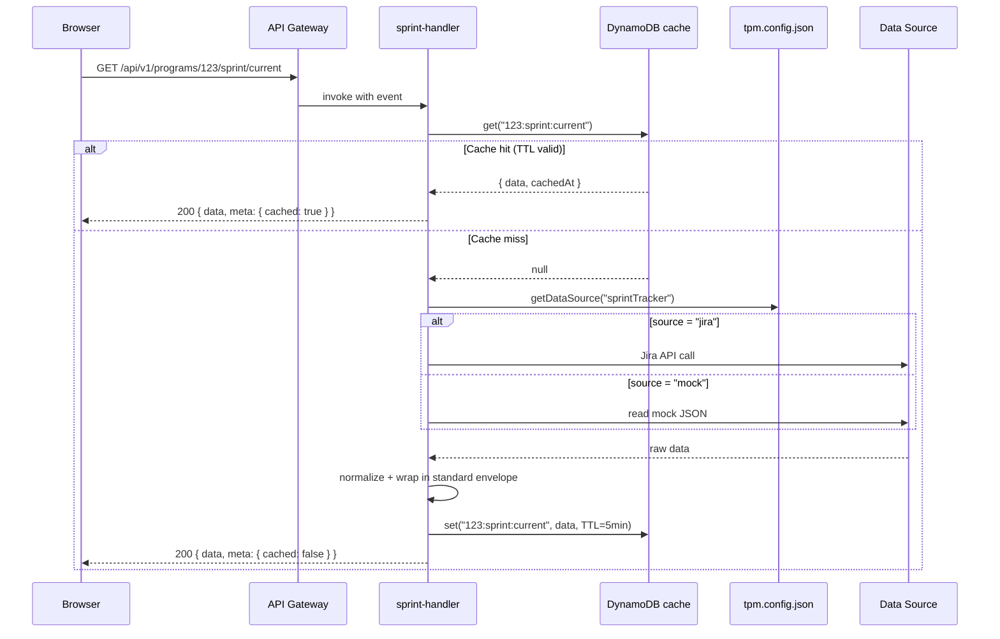
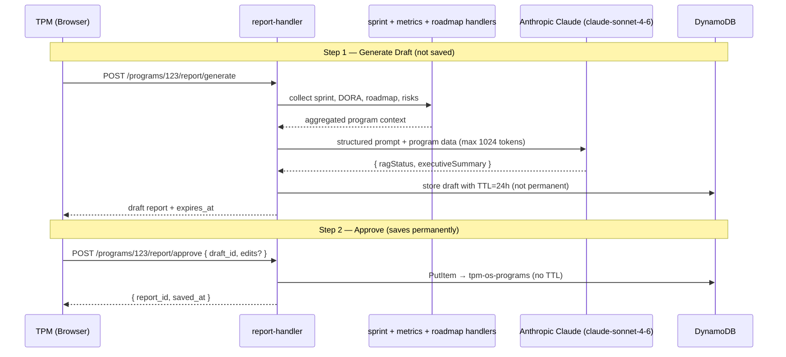
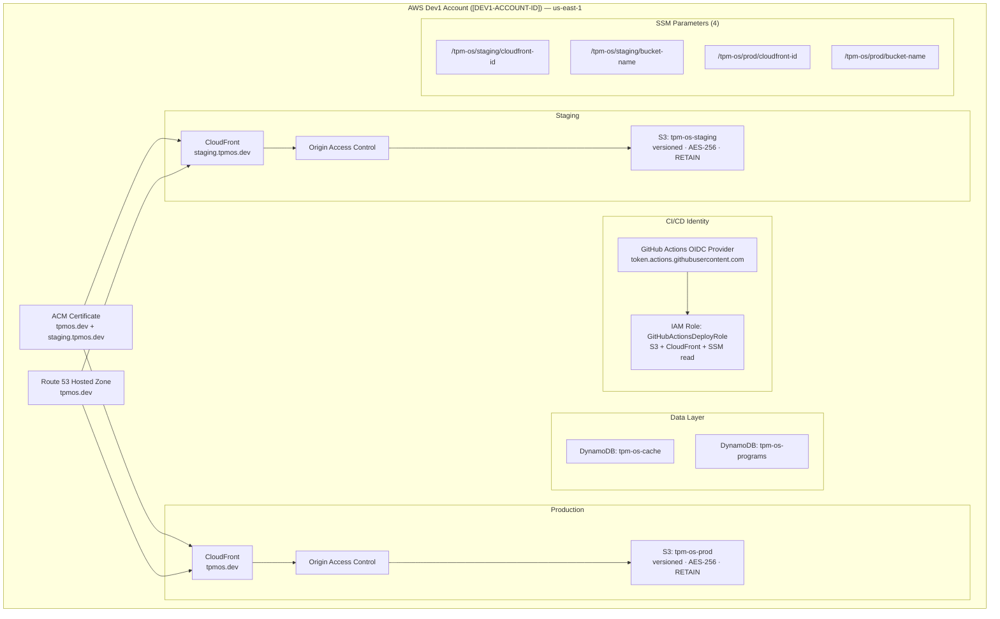
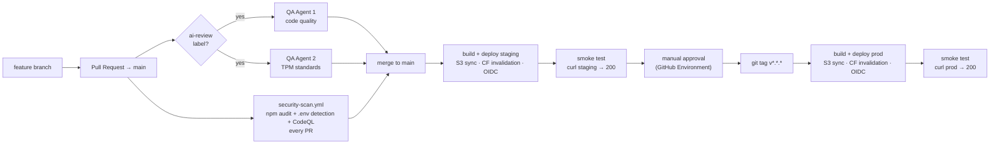

# TPM OS — Architecture

## Overview

TPM OS is a dark-themed single-page application that gives Technical Program Managers a unified view across sprint health, DORA engineering metrics, roadmap progress, and AI-assisted status reporting. The frontend is a React 18 + Vite app hosted on AWS S3 behind CloudFront, served from two environments (`staging.tpmos.dev` and `tpmos.dev`). The backend is six TypeScript AWS Lambda functions behind API Gateway, organized by domain (sprint, metrics, roadmap, report, programs, system), all sharing a common response envelope, a DynamoDB cache, and a config-driven data-source routing layer. Infrastructure is defined entirely in AWS CDK — nothing is clicked in the console. An Anthropic Claude API integration powers a two-step AI report-generation flow with a mandatory human-approval gate before any report is persisted.

---

## System Architecture Diagram



---

## Frontend Architecture

**Stack:** React 18.3.1 · Vite 5 · Tailwind CSS 3.4 · Recharts 2.12.7 · React Router

### Component map

| File | Role |
|------|------|
| `src/App.jsx` | Root app, 3-view router (sprint / metrics / roadmap) |
| `src/components/Sidebar.jsx` | Navigation + view switcher |
| `src/views/SprintTracker.jsx` | Kanban board, burndown chart, velocity trend |
| `src/views/EngineeringMetrics.jsx` | DORA metrics, deployment frequency chart, incident log |
| `src/views/Roadmap.jsx` | Gantt chart, OKR grid, capacity tracker, risk register |

### Data layer

All three dashboards currently read from local mock JSON files in `src/data/`. The `tpm.config.json` at the project root controls which source backs each dashboard — switching a value from `"mock"` to `"jira"` reroutes that dashboard through the backend API with no code changes and no redeployment.

```
src/data/
  sprints.json · tickets.json · deployments.json · incidents.json
  initiatives.json · okrs.json · risks.json · team_capacity.json · pull_requests.json
```

### Build

Vite outputs to `dist/` with content-hashed asset filenames. `index.html` bypasses long-term caching; all other assets are cached for one year (`Cache-Control: max-age=31536000, immutable`). `VITE_BASE_URL` is injected at build time to set the API base URL per environment.

---

## Backend Architecture

### API Design Principles

1. **Program-centric** — every endpoint is scoped to `/programs/:id`; no global queries in v1
2. **Source-agnostic** — response shape is identical regardless of data source (mock, Jira, GitHub)
3. **Versioned** — all endpoints live under `/api/v1/`; breaking changes bump the major version
4. **Standard envelope** — every response uses `{ data, meta, error }`
5. **Graceful degradation** — live source failure falls back to mock; `meta.fallback = true` signals this
6. **Cache-first** — all GET responses cached in DynamoDB at 5-minute TTL; `report/generate` bypasses cache entirely
7. **Config-driven** — `tpm.config.json` controls source routing per program at request time

### Lambda Function Map



### Endpoint Inventory

| Handler | Method | Path | Action |
|---------|--------|------|--------|
| programs | GET | `/programs` | List all programs |
| programs | POST | `/programs` | Create program |
| programs | GET | `/programs/:id` | Get program |
| programs | PATCH | `/programs/:id` | Update program |
| sprint | GET | `/:id/sprint/current` | Current sprint state |
| sprint | GET | `/:id/sprint/velocity` | Velocity trend |
| sprint | PATCH | `/:id/sprint/:ticketId` | Move ticket |
| metrics | GET | `/:id/metrics/dora` | DORA four key metrics |
| metrics | GET | `/:id/metrics/deployments` | Deployment history |
| metrics | GET | `/:id/metrics/incidents` | Incident log |
| roadmap | GET | `/:id/roadmap/initiatives` | Initiative list |
| roadmap | GET | `/:id/roadmap/okrs` | OKR grid |
| roadmap | GET | `/:id/roadmap/risks` | Risk register |
| roadmap | PATCH | `/:id/roadmap/:initiativeId` | Update initiative |
| roadmap | PATCH | `/:id/roadmap/:riskId` | Update risk |
| report | POST | `/:id/report/generate` | Generate AI draft |
| report | POST | `/:id/report/approve` | Save approved report |
| report | GET | `/:id/report/:reportId` | Fetch one report |
| report | GET | `/:id/report/history` | Report history |
| system | GET | `/health` | Health check |
| system | GET | `/config` | Global config |
| system | POST | `/invalidate` | Global cache clear |
| system | GET | `/:id/system/config` | Per-program resolved config |
| system | POST | `/:id/system/cache/invalidate` | Per-program cache clear |

### Data Flow: Cache-Aside Request



### AI Report Generation Flow



---

## Infrastructure Architecture

### AWS Account Structure

```
Management Account ([MGMT-ACCOUNT-ID])
└── Sandbox OU
    ├── Sandbox ([SANDBOX-ACCOUNT-ID]) — Control Tower managed
    └── Dev1 ([DEV1-ACCOUNT-ID])   — active deployment target (us-east-1)
        ├── staging.tpmos.dev
        └── tpmos.dev
└── Security OU
    ├── Audit ([AUDIT-ACCOUNT-ID])
    └── Log Archive ([LOG-ARCHIVE-ACCOUNT-ID])
```

Access is via IAM Identity Center SSO — no static credentials, no root user usage.

### Environment Architecture



### CDK Stack Resource Inventory

| Resource | Name | Notes |
|----------|------|-------|
| S3 Bucket | `tpm-os-staging` | OAC-only, versioned, RETAIN on destroy |
| S3 Bucket | `tpm-os-prod` | OAC-only, versioned, RETAIN on destroy |
| S3 Bucket | `tpm-os-dev` | Local sync target only, no CloudFront |
| CloudFront Distribution | staging.tpmos.dev | HTTPS, TLS 1.2+, Price Class 100, SPA 404→200 |
| CloudFront Distribution | tpmos.dev | HTTPS, TLS 1.2+, Price Class 100, SPA 404→200 |
| Origin Access Control | (staging) | SigV4 signing, restricts S3 to CloudFront only |
| Origin Access Control | (prod) | SigV4 signing, restricts S3 to CloudFront only |
| ACM Certificate | tpmos.dev + staging.tpmos.dev | us-east-1, required for CloudFront |
| Route 53 A Record | `tpmos.dev` | Alias → prod CloudFront |
| Route 53 A Record | `staging.tpmos.dev` | Alias → staging CloudFront |
| GitHub OIDC Provider | `token.actions.githubusercontent.com` | Keyless federation |
| IAM Role | `GitHubActionsDeployRole` | Scoped to `repo:harshul88/tpm-dashboard:*` |
| SSM Parameter | `/tpm-os/staging/cloudfront-id` | Read by CI at deploy time |
| SSM Parameter | `/tpm-os/staging/bucket-name` | Read by CI at deploy time |
| SSM Parameter | `/tpm-os/prod/cloudfront-id` | Read by CI at deploy time |
| SSM Parameter | `/tpm-os/prod/bucket-name` | Read by CI at deploy time |
| DynamoDB Table | `tpm-os-cache` | pk=`key`, TTL attribute enabled |
| DynamoDB Table | `tpm-os-programs` | pk=`id` |

### Promotion Pipeline



Staging auto-deploys on every merge to `main`. A new push cancels any in-flight staging deploy. Production deploys on `v*.*.*` tags only, requires a required reviewer on the `production` GitHub Environment, and is never cancelled mid-flight.

---

## Security Architecture

### Security Controls by Layer

**Layer 1 — Source Control**
- Branch protection on `main` — all changes via pull request, required status checks before merge
- GitHub Secret Scanning — blocks committed credentials
- Dependabot — weekly dependency updates
- CodeQL SAST — JavaScript analysis on every PR

**Layer 2 — CI/CD**
- GitHub Actions OIDC — no static AWS keys stored anywhere in the repo or GitHub Secrets
- Keyless deployment via IAM role trust policy bound to repo + branch
- Scoped IAM permissions — deploy role covers S3, CloudFront, and SSM read only
- `npm audit` — blocks merges if moderate-or-higher severity vulnerabilities are present
- QA agents review code quality and TPM standards on labelled PRs

**Layer 3 — CDN / Edge**
- HTTPS enforced — HTTP requests redirected to HTTPS at CloudFront edge
- TLS 1.2 minimum (CloudFront Security Policy 2021)
- Security response headers on all responses:
  - `Strict-Transport-Security: max-age=63072000; includeSubDomains; preload`
  - `Content-Security-Policy: default-src 'self'; style-src 'self' 'unsafe-inline'; img-src 'self' https: data:`
  - `X-Frame-Options: DENY`
  - `X-Content-Type-Options: nosniff`
  - `Referrer-Policy: strict-origin-when-cross-origin`
  - `Permissions-Policy: camera=(), microphone=(), geolocation=()`
- Origin Access Control — S3 buckets reject all non-CloudFront requests

**Layer 4 — AWS Account**
- IAM Identity Center SSO — federated login, no root user for day-to-day operations
- MFA on root account and SSO user
- AWS GuardDuty — continuous threat detection and anomaly alerting
- AWS CloudTrail — full API audit log across all services
- Cost Anomaly Detection at $5 alert threshold
- Free tier usage alerts enabled

**Layer 5 — Application (planned)**
- AWS Secrets Manager for API keys — Phase 5
- AWS WAF on CloudFront — Phase 6
- Cognito authentication — Phase 6

### Threat Model

| Threat | Control | Status |
|--------|---------|--------|
| Secret exposure in source code | GitHub Secret Scanning + `tpm.config.json` in `.gitignore` | ✅ |
| Dependency vulnerabilities | Dependabot + `npm audit` in CI | ✅ |
| XSS attacks | Content-Security-Policy header | ✅ |
| Clickjacking | `X-Frame-Options: DENY` | ✅ |
| Static credential theft | OIDC keyless auth — no stored AWS keys | ✅ |
| Overprivileged deploy role | IAM scoped to S3 + CloudFront + SSM read | ✅ |
| Direct S3 access bypass | Origin Access Control on all buckets | ✅ |
| Account compromise | MFA + GuardDuty + CloudTrail | ✅ |
| DDoS / bot traffic | CloudFront absorbs edge + WAF planned (Phase 6) | 🔲 |
| API key exfiltration at runtime | Secrets Manager planned (Phase 5) | 🔲 |
| Unauthorized API access | Cognito authentication planned (Phase 6) | 🔲 |

---

## Data Architecture

### Data Sources

| Dashboard | Current Source | Available Sources |
|-----------|---------------|-------------------|
| Sprint Tracker | Mock JSON | Jira, GitHub Issues, Linear |
| Engineering Metrics | Mock JSON | GitHub Actions, PagerDuty |
| Roadmap | Mock JSON | Notion, Google Sheets, Jira Epics |

Source switching is controlled by `tpm.config.json` per program, read at request time. No redeployment required to change a data source.

### Core Data Models (`backend/shared/models.ts`)

```typescript
type ProgramType   = 'product_dev' | 'compliance' | 'migration' | 'initiative'
type ProgramStatus = 'green' | 'amber' | 'red'
type Source        = 'mock' | 'system' | 'github' | 'notion' | 'jira'
                   | 'linear' | 'pagerduty' | 'google-sheets'

interface Dashboard {
  id:          'sprint' | 'metrics' | 'roadmap' | 'report'
  enabled:     boolean
  data_source: Source
}

interface Program {
  id:              string          // UUID
  name:            string
  type:            ProgramType
  description:     string
  status:          ProgramStatus   // computed from data
  status_override: ProgramStatus | null   // set by TPM, takes precedence
  dashboards:      Dashboard[]
  sharing:         { enabled: boolean; collaborators: string[] }
  data_sources:    { sprint: Source; metrics: Source; roadmap: Source }
  created_at:      string          // ISO 8601
  updated_at:      string
}
```

`PROGRAM_TEMPLATES` defines default dashboard sets per type:

| Template | sprint | metrics | roadmap | report |
|----------|:------:|:-------:|:-------:|:------:|
| `product_dev` | ✅ | ✅ | ✅ | ✅ |
| `compliance` | — | — | ✅ | ✅ |
| `migration` | ✅ | — | ✅ | ✅ |
| `initiative` | — | — | ✅ | ✅ |

### Caching Strategy

| Aspect | Detail |
|--------|--------|
| Store | DynamoDB `tpm-os-cache`, pk = cache key string |
| TTL | 5 minutes (from `tpm.config.json`, overridable) |
| Key format | `{programId}:{dashboard}:{endpoint}` or `global:programs` |
| TTL enforcement | Lambda reads `Item.ttl` field and rejects expired entries |
| Cache bypass | `BYPASS_CACHE=true` env var causes `get()` to always return null |
| Invalidation | Pattern-scan + delete, scoped by program or dashboard |
| Report exception | `POST /report/generate` never reads or writes the cache |
| Stale fallback | If source is unavailable, serve expired cache with `meta.fallback=true` |

### Standard Response Envelope

Every API response — success or error — uses the same shape:

```typescript
{
  data: unknown,
  meta: {
    source:    Source
    cached:    boolean
    cached_at: string | null   // ISO 8601
    fallback:  boolean
    version:   '1.0.0'
  },
  error: { code: string; message: string; retryable: boolean } | null
}
```

### Data Point Audit Envelope

Every numeric field returned by the API carries source provenance:

```typescript
interface DataPoint {
  value:          number
  source_at_time: Source    // which integration was active when recorded
  recorded_at:    string    // ISO 8601
  updated_by:     'system' | 'tpm'
}
```

Switching data sources mid-program does not silently corrupt historical comparisons — each value carries the source context under which it was captured.

---

## Technology Decisions

| Decision | Choice | Why | Alternatives considered |
|----------|--------|-----|------------------------|
| Frontend framework | React 18 + Vite 5 | Fast HMR, industry standard, large ecosystem | Vue 3, Angular |
| Styling | Tailwind CSS | Utility-first, eliminates separate CSS file sprawl | styled-components, CSS Modules |
| Charts | Recharts | React-native SVG, composable, good out-of-box defaults | Chart.js, D3.js |
| Infrastructure as Code | AWS CDK v2 (TypeScript) | Same language as app, type-safe first-class AWS constructs | Terraform, Pulumi |
| Hosting | AWS S3 + CloudFront | Enterprise-grade CDN, cost-effective, native ACM integration | Vercel, Netlify |
| Database | DynamoDB | Serverless, zero infra to manage, free tier generous | PostgreSQL (RDS), MongoDB Atlas |
| AI provider | Anthropic Claude (`claude-sonnet-4-6`) | Best structured reasoning, strong context window for TPM reports | OpenAI GPT-4o, Google Gemini |
| DNS | Route 53 | Native AWS integration, ACM auto-validation within same CDK stack | Cloudflare, GoDaddy |
| Lambda bundler | esbuild | Sub-second TS → ESM builds, tree-shakes `@aws-sdk/*` externals | webpack, tsc only |
| CI auth | GitHub Actions OIDC | No secret rotation, no credential storage anywhere | Static IAM access keys |

---

## Industry Best Practices Applied

1. **Infrastructure as Code** — every AWS resource is in CDK; nothing is created manually in the console
2. **Keyless deployments** — OIDC trust policy eliminates static credentials from CI entirely
3. **Least-privilege IAM** — deploy role is scoped to S3, CloudFront, and SSM read; no broader access
4. **Defence in depth** — independent security controls at source control, CI/CD, CDN edge, and AWS account layers
5. **Graceful degradation** — mock fallback keeps all three dashboards rendering when live sources are unavailable
6. **Cache-aside pattern** — DynamoDB TTL cache reduces external API calls, lowers cost, and cuts p99 latency
7. **API versioning from day one** — `/v1/` prefix allows non-breaking API evolution without coordinated client updates
8. **Human in the loop** — AI-generated status reports are drafts; a TPM must explicitly approve before any report is persisted
9. **Source audit trail** — every numeric data point carries `source_at_time`, `recorded_at`, and `updated_by` for historical integrity
10. **Environment parity** — staging and production use identical CDK constructs, same build pipeline, and the same smoke test
